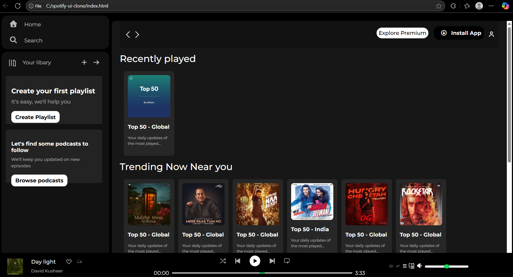

# 🎵 Spotify UI Clone  

A simple **Spotify web player UI clone** built using **HTML, CSS, and JavaScript**.  
This project replicates the look and feel of Spotify’s desktop app, focusing on clean design, responsive layout, and interactive music controls.  

---

## 🚀 Demo  

  

---

## ✨ Features  

- 🎧 **Music Player Controls** – Play, pause, next/previous track  
- 🖼️ **Album Covers & Thumbnails** – Display album art dynamically  
- 📻 **Volume & Progress Slider** – Styled sliders with smooth UI  
- 📱 **Responsive Layout** – Works across devices  

---

## 📂 Project Structure  


## 🛠️ Tech Stack  

<p>
  
  
</p>

---

## 📂 Project Structure  

```bash
📦 spotify-ui-clone
├── index.html        # 🎯 Main entry point (UI layout & structure)
├── style.css         # 🎨 Custom styles (UI styling & theming)
├── assets/           # 📂 Folder for all static assets
│   └── Homework Assets/   # 🖼️ Icons, covers, logos
└── README.md         # 📘 Project documentation (setup & usage guide)
```

## 📖 How to Run  

 Clone the repository:  
   ```bash
   git clone https://github.com/Giridhar-Gedela/spotify-ui-clone.git
```
<!--📸 Screenshots -->


## Roadmap / Future Enhancements

Add JavaScript for more interactivity.

Implement a dark/light mode toggle.

Integrate with the Spotify Web API for real streaming features.

## Contributing

Contributions, issues, and feature requests are welcome.
You can fork this repository and submit a pull request.

---
